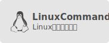
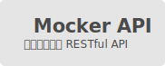
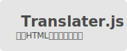
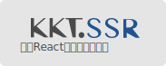

# 笔记/搜集/摘录/实践

放置我的笔记、搜集、摘录、实践，保持好奇心。这里就是个随记，涉猎技术知识点广而不精，不能保证正确，看文需谨慎，后果很严重。

## 精华置顶

- [awesome-mac](https://jaywcjlove.github.io/awesome-mac)  - 收集分享大量非常好用的Mac应用程序。 [![Open-Source Software][OSS Icon]](https://github.com/jaywcjlove/awesome-mac) ![hot][hot Icon]
- [awesome-uikit](https://github.com/jaywcjlove/awesome-uikit)  - 搜集基于 React/Vue/Angular 的UI组件库管理平台模版。 [![Open-Source Software][OSS Icon]](https://github.com/jaywcjlove/awesome-uikit) ![hot][hot Icon]
- [bannerjs](https://github.com/jaywcjlove/bannerjs)  - 获取基于 package.json 的单行/多行注释标题。 [![Open-Source Software][OSS Icon]](https://github.com/jaywcjlove/bannerjs)
- [cookie.js](https://github.com/jaywcjlove/cookie.js)  - 轻量级的用于处理浏览器 cookie JS库，没有依赖。 [![Open-Source Software][OSS Icon]](https://github.com/jaywcjlove/cookie.js)
- [console-emojis](https://github.com/jaywcjlove/console-emojis)  - 使用表情符号自定义控制台日志记录。 [![Open-Source Software][OSS Icon]](https://github.com/jaywcjlove/console-emojis)
- [colors-cli](https://github.com/jaywcjlove/colors-cli)  - 给命令行终端字符串设置样式和颜色。 [![Open-Source Software][OSS Icon]](https://github.com/jaywcjlove/colors-cli)
- [docker-tutorial](https://github.com/jaywcjlove/docker-tutorial)  - Docker 入门教程读书笔。 [![Open-Source Software][OSS Icon]](https://github.com/jaywcjlove/docker-tutorial)
- [docs](https://github.com/jaywcjlove/docs)  - 通过 docker 集中化管理各种文档。 [![Open-Source Software][OSS Icon]](https://github.com/jaywcjlove/docker-tutorial)
- [FED](https://github.com/jaywcjlove/FED)  - 很酷炫的前端网站搜集器，导航网。 [![Open-Source Software][OSS Icon]](https://github.com/jaywcjlove/FED)
- [github-rank](http://jaywcjlove.github.io/github-rank/)  - Github用户排名，仓库排名趋势榜。 [![Open-Source Software][OSS Icon]](https://github.com/jaywcjlove/github-rank)
- [golang-tutorial](https://github.com/jaywcjlove/golang-tutorial)  - Golang 入门教程读书笔。 [![Open-Source Software][OSS Icon]](https://github.com/jaywcjlove/golang-tutorial)
- [git-tips](https://github.com/jaywcjlove/git-tips)  - Git 常用命令及教程网站清单。 [![Open-Source Software][OSS Icon]](https://github.com/jaywcjlove/git-tips)
- [hotkeys](https://jaywcjlove.github.io/hotkeys/)  - 用于捕获键盘输入和输入的组合键 JS 库，它没有依赖。 [![Open-Source Software][OSS Icon]](https://github.com/jaywcjlove/hotkeys) ![hot][hot Icon]
- [idoc](https://github.com/jaywcjlove/idoc)  - 简单的文档生成工具 idoc。 [![Open-Source Software][OSS Icon]](https://github.com/jaywcjlove/idoc)
- [kkt](https://github.com/jaywcjlove/kkt)  - 创建没有构建配置 React 应用程序的 Cli 工具。 [![Open-Source Software][OSS Icon]](https://github.com/jaywcjlove/kkt)
- [kkt-ssr](https://github.com/jaywcjlove/kkt-ssr)  - 无需配置即可创建 React 服务器端呈现工具。 [![Open-Source Software][OSS Icon]](https://github.com/jaywcjlove/kkt-ssr)
- [linux-command](https://jaywcjlove.github.io/linux-command/)  - Linux命令搜索引擎，命令手册、详解、学习，速查手册。 [![Open-Source Software][OSS Icon]](https://github.com/jaywcjlove/linux-command)
- [mocker-api](https://jaywcjlove.github.io/mocker-api/)  - 为 REST API 创建模拟，用于开发模式模拟 API 请求。 [![Open-Source Software][OSS Icon]](https://github.com/jaywcjlove/hotkeys)
- [mysql-tutorial](https://github.com/jaywcjlove/mysql-tutorial)  - MySQL 入门教程学习笔记。 [![Open-Source Software][OSS Icon]](https://github.com/jaywcjlove/mysql-tutorial)
- [magic-input](https://github.com/jaywcjlove/magic-input)  - Checkbox和单选按钮输入的CSS3样式看起来更漂亮，只有一个元素。 [![Open-Source Software][OSS Icon]](https://github.com/jaywcjlove/magic-input)
- [nginx-tutorial](https://github.com/jaywcjlove/nginx-tutorial)  - Nginx 安装维护入门学习笔记。 [![Open-Source Software][OSS Icon]](https://github.com/jaywcjlove/nginx-tutorial)
- [oscnews](https://github.com/jaywcjlove/oscnews)  - Chrome 插件，查看新闻资讯，文档导航，GitHub 趋势榜等功能。 [![Open-Source Software][OSS Icon]](https://github.com/jaywcjlove/oscnews)
- [package.json](https://github.com/jaywcjlove/package.json)  - 文件 package.json 的说明文档。 [![Open-Source Software][OSS Icon]](https://github.com/jaywcjlove/package.json)
- [svgtofont](https://github.com/jaywcjlove/svgtofont)  - 读取一组SVG图标并输出 TTF/EOT/WOFF/WOFF2/SVG 字体。 [![Open-Source Software][OSS Icon]](https://github.com/jaywcjlove/svgtofont)
- [react-monacoeditor](https://github.com/jaywcjlove/react-monacoeditor)  - React的 Monaco Editor 编辑器组件。 [![Open-Source Software][OSS Icon]](https://github.com/jaywcjlove/react-monacoeditor)
- [react-native](https://github.com/jaywcjlove/react-native)  - React Native 的各种问题搜集。 [![Open-Source Software][OSS Icon]](https://github.com/jaywcjlove/react-monacoeditor)
- [ssr](https://github.com/jaywcjlove/ssr)  - 工具 SSR 用于快速原型设计的开发服务器。 [![Open-Source Software][OSS Icon]](https://github.com/jaywcjlove/ssr) ![hot][hot Icon]
- [store.js](https://github.com/jaywcjlove/store.js)  - 本地存储localStorage的封装，提供简单的API，没有依赖。 [![Open-Source Software][OSS Icon]](https://github.com/jaywcjlove/store.js)
- [shell-tutorial](https://github.com/jaywcjlove/shell-tutorial)  - Shell 入门教程学习笔记。 [![Open-Source Software][OSS Icon]](https://github.com/jaywcjlove/shell-tutorial)
- [swift-tutorial](https://github.com/jaywcjlove/swift-tutorial)  - Swift 入门教程读书笔记。 [![Open-Source Software][OSS Icon]](https://github.com/jaywcjlove/swift-tutorial)
- [tsbb](https://github.com/jaywcjlove/tsbb)  - TSBB是一个零配置CLI，可帮助您开发，测试和发布现代 TypeScript 项目。 [![Open-Source Software][OSS Icon]](https://github.com/jaywcjlove/tsbb)
- [translater.js](https://github.com/jaywcjlove/translater.js)  - 这是一个利用HTML注释的页面翻译解决方案。 [![Open-Source Software][OSS Icon]](https://github.com/jaywcjlove/translater.js)
- [uiw](https://github.com/uiwjs/uiw)  - 高质量的 UI 组件库基于 React 的组件库。 [![Open-Source Software][OSS Icon]](https://github.com/uiwjs/uiw) ![hot][hot Icon]
- [vim-web](https://github.com/jaywcjlove/vim-web)  - 搞得像IDE一样的Vim，安装配置自己的Vim。 [![Open-Source Software][OSS Icon]](https://github.com/jaywcjlove/vim-web)

## CentOS 

- **[Rocket.Chat 开源IM系统部署★★★★](CentOS/Rocket.Chat.md)**
- **[安装维护Gitlab★★★★](CentOS/CentOS7安装维护Gitlab.md)**
- [CentOS常用基础命令](CentOS/CentOS.md)
- [CentOS7网络配置](CentOS/CentOS7网络配置.md)
- [KVM虚拟机安装详解](CentOS/CentOS7安装KVM虚拟机详解.md)
- [OpenStack安装使用](CentOS/CentOS7安装openstack.md)
- [Elasticsearch安装维护](CentOS/Elasticsearch安装维护.md)
- [samba安装搭建使用](CentOS/samba.md)
- [安装配置vsftp搭建FTP](CentOS/CentOS7安装配置vsftp搭建FTP.md)
- **[安装使用svn](CentOS/安装使用svn.md)**
- [中修改ssh端口号的方法](CentOS/修改ssh端口号的方法.md)
- [Centos7安装编译Node](CentOS/Centos7安装编译Node.md)
- [Linux添加、删除用户和用户组](CentOS/Linux添加、删除用户和用户组.md)
- [Seafile部署搭建自己的网盘](CentOS/部署Seafile搭建自己的网盘.md)
- [Mac下制作CentOS7启动盘](CentOS/Mac下制作CentOS7启动盘.md)
- [尝试在CentOS7.2上编译安装Swift 4.0](CentOS/尝试在CentOS7.2上编译安装Swift.md)
- [使用免费SSL证书让网站支持HTTPS访问](CentOS/使用免费SSL证书让网站支持HTTPS访问.md)
- [5分钟内3种方法搭建企业内部私有npm仓库](CentOS/在5分钟内搭建企业内部私有npm仓库.md)
- [部署高效、易用、功能强大的api管理平台](CentOS/部署YApi平台.md)

## [MySQL入门教程学习笔记](https://github.com/jaywcjlove/mysql-tutorial)

搜集整合的MySQL笔记迁移到[这里了](https://github.com/jaywcjlove/mysql-tutorial) ★★★

## [10分钟入门Redis](Redis/README.md)

Redis是一个开源的，先进的 key-value 存储可用于构建高性能的存储解决方案，入门介绍就到这里了。

## Android

- [Mac完整卸载Android Studio的方法](Android/Mac%E5%AE%8C%E6%95%B4%E5%8D%B8%E8%BD%BDAndroid%20Studio%E7%9A%84%E6%96%B9%E6%B3%95.md)
- [React-native Android环境搭建](Android/React-native%20Android%E7%8E%AF%E5%A2%83%E6%90%AD%E5%BB%BA.md)

## 前端&后端&Node

- **[工具 ssr 用于快速原型设计的开发服务器★★★★](https://github.com/jaywcjlove/ssr)**
- [搜集React/Vue/Angular组件库和后台管理平台模板](https://github.com/jaywcjlove/awesome-uikit)
- **[思维导图来学习 Javascript 基础知识★★★★](Javascript/)**
- [轻量高效的开源JavaScript插件和库★★★★★](Javascript/轻量高效的开源JavaScript插件和库.md)
- [一些正则表达式随记](Javascript/一些正则表达式随记.md)
- [web开发的框架Backbone.js手册](http://jaywcjlove.github.io/handbook/index.html)
- [前端工程师也需要zsh](http://mp.weixin.qq.com/s?__biz=MzAwNzgxMjYzMA==&mid=401433562&idx=1&sn=1ca074b0629463f37a777a2b96aa98af)
- [使用Node.js制作命令行工具学习教程](https://github.com/jaywcjlove/wcj)

## 快捷键

- [Sketch 设计软件快捷键](https://github.com/jaywcjlove/handbook/blob/f927defdc74fc3adfeb4f2764893426685284327/md/Shortcuts/Sketch.md)
- [命令行工具bash快捷键](https://github.com/jaywcjlove/handbook/blob/f927defdc74fc3adfeb4f2764893426685284327/md/Shortcuts/bash.md)
- [Sublime 编辑器快捷键](https://github.com/jaywcjlove/handbook/blob/f927defdc74fc3adfeb4f2764893426685284327/md/Shortcuts/sublime.md)

## 其它

- **[70多个公众账号推荐，助你了解程序员的世界★★★★★](other/公众账号推荐.md)**
- **[常见HTTP/FTP/WebSockets状态码大全★★★★★](other/HTTP-Status-codes.md)**
- [国内互联网公司的开源项目及Github地址汇总](other/Github-Oraganizations.md)
- [通过代理工具提高Github Clone速度](other/通过代理工具提高Github%20Clone速度.md)
- [谷歌(Google)镜像](https://github.com/jaywcjlove/google)
- [Lua5.3中文手册](other/Lua5.3.md)

[hot Icon]: https://jaywcjlove.github.io/sb/ico/min-hot.svg "Hot"
[OSS Icon]: https://jaywcjlove.github.io/sb/ico/min-oss.svg "Open source ui componet on Github"