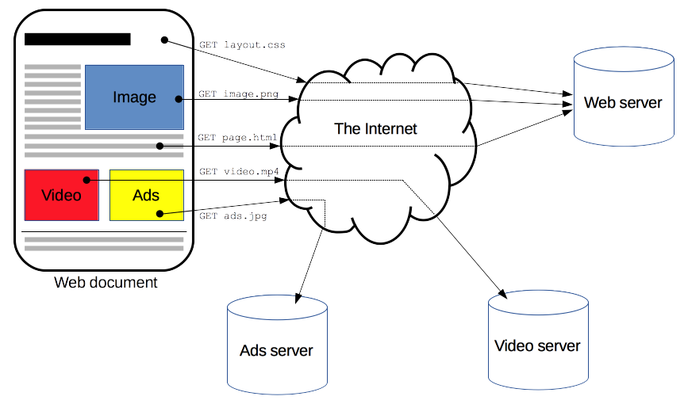

常见HTTP/FTP/WebSocket错误代码大全
---

目录
===
<!-- TOC -->

- [HTTP](#http)
  - [1xx消息](#1xx消息)
  - [2xx成功](#2xx成功)
  - [3xx重定向](#3xx重定向)
  - [4xx客户端错误](#4xx客户端错误)
  - [5xx服务器错误](#5xx服务器错误)
- [FTP](#ftp)
  - [1xx初步](#1xx初步)
  - [2xx完成](#2xx完成)
  - [3xx中间](#3xx中间)
  - [4xx瞬态否定](#4xx瞬态否定)
- [5xx永久性否定](#5xx永久性否定)
- [6xx受保护](#6xx受保护)
- [WebSockets状态码](#websockets状态码)
- [参考资料](#参考资料)

<!-- /TOC -->

## HTTP

### 1xx消息

_这一类型的状态码，代表请求已被接受，需要继续处理。这类响应是临时响应，只包含状态行和某些可选的响应头信息，并以空行结束。由于HTTP/1.0协议中没有定义任何1xx状态码，所以除非在某些试验条件下，服务器禁止向此类客户端发送1xx响应。 这些状态码代表的响应都是信息性的，标示客户应该采取的其他行动。_

- 100 - 客户端应当继续发送请求
- 101 - 切换协议
- 102 - 处理将被继续执行

### 2xx成功

_这一类型的状态码，代表请求已成功被服务器接收、理解、并接受。_

- 200 - （成功）请求已成功，请求所希望的响应头或数据体将随此响应返回。
- 201 - （已创建）请求成功且服务器已创建了新的资源。。
- 202 - （已接受）服务器已接受了请求，但尚未对其进行处理。
- 203 - （非授权信息）服务器已成功处理了请求，但返回了可能来自另一来源的信息。
- 204 - （无内容）服务器成功处理了请求，但未返回任何内容。
- 205 - （重置内容）服务器成功处理了请求，但未返回任何内容。
- 206 - （部分内容）服务器成功处理了部分 GET 请求。

### 3xx重定向

_这类状态码代表需要客户端采取进一步的操作才能完成请求。通常，这些状态码用来重定向，后续的请求地址（重定向目标）在本次响应的Location域中指明。按照HTTP/1.0版规范的建议，浏览器不应自动访问超过5次的重定向。对重定向一般是由浏览器来控制重定向的次数，重定向会导致客户端不必要的资源消耗_

- 300 - 多重选择，被请求的资源有一系列可供选择的回馈信息。
- 301 - 永久移除，被请求的资源已永久移动到新位置。
- 302 - 临时移动，请求的资源现在临时从不同的URI响应请求。
- 303 - 查看其他位置，对应当前请求的响应可以在另一个URI上被找到，而且客户端应当采用GET的方式访问那个资源。
- 304 - 未修改。自从上次请求后，请求的网页未被修改过。服务器返回此响应时，不会返回网页内容。
- 305 - 使用代理，被请求的资源必须通过指定的代理才能被访问。
- <del>306</del> - 临时重定向，在最新版的规范中，306状态码已经不再被使用。
- 307 - 临时重定向。

### 4xx客户端错误

_这类的状态码代表了客户端看起来可能发生了错误，妨碍了服务器的处理。_

- 400 - 错误的请求。
- 401 - 访问被拒绝。
- 402 - 付款要求。
- 403 - 禁止访问
  - 403.1 - 执行访问被禁止。
  - 403.2 - 读访问被禁止。
  - 403.3 - 写访问被禁止。
  - 403.4 - 要求 SSL。
  - 403.5 - 要求 SSL 128。
  - 403.6 - IP 地址被拒绝。
  - 403.7 - 要求客户端证书。
  - 403.8 - 站点访问被拒绝。
  - 403.9 - 用户数过多。
  - 403.10 - 配置无效。
  - 403.11 - 密码更改。
  - 403.12 - 拒绝访问映射表。
  - 403.13 - 客户端证书被吊销。
  - 403.14 - 拒绝目录列表。
  - 403.15 - 超出客户端访问许可。
  - 403.16 - 客户端证书不受信任或无效。
  - 403.17 - 客户端证书已过期或尚未生效。
  - 403.18 - 在当前的应用程序池中不能执行所请求的 URL。
  - 403.19 - 不能为这个应用程序池中的客户端执行 CGI。
  - 403.20 - Passport 登录失败。
- 404 - 未找到。
  - 404.0 -（无） – 没有找到文件或目录。
  - 404.1 - 无法在所请求的端口上访问 Web 站点。
  - 404.2 - Web 服务扩展锁定策略阻止本请求。
  - 404.3 - MIME 映射策略阻止本请求。
- 405 - 用来访问本页面的 HTTP 谓词不被允许（方法不被允许）
- 406 - 客户端浏览器不接受所请求页面的 MIME 类型。
- 407 - 要求进行代理身份验证。
- 408 - 请求超时。
- 409 - 由于和被请求的资源的当前状态之间存在冲突，请求无法完成。
- 410 - 被请求的资源在服务器上已经不再可用，而且没有任何已知的转发地址。
- 411 - 服务器拒绝在没有定义Content-Length头的情况下接受请求。
- 412 - 前提条件失败。
- 413 – 请求实体太大。
- 414 - 请求 URI 太长。
- 415 – 不支持的媒体类型。
- 416 – 所请求的范围无法满足。
- 417 – 执行失败。
- 418 – 本操作码是在1998年作为IETF的传统[愚人节笑话](http://www.baike.com/wiki/%E6%81%B6%E6%90%9ERFC)。
- 421 – 从当前客户端所在的IP地址到服务器的连接数超过了服务器许可的最大范围。
- 422 – 请求格式正确，但是由于含有语义错误，无法响应。
- 423 – 当前资源被锁定。
- 424 – 由于之前的某个请求发生的错误，导致当前请求失败。
- 425 – 无序的集合。
- 426 – 客户端应当切换到TLS/1.0。
- 451 – （由IETF在2015核准后新增加）该访问因法律的要求而被拒绝。

### 5xx服务器错误

_这类状态码代表了服务器在处理请求的过程中有错误或者异常状态发生，也有可能是服务器意识到以当前的软硬件资源无法完成对请求的处理。_

- 500 - 内部服务器错误。
- 501 - 尚未实施，页眉值指定了未实现的配置。
- 502 - 错误网关，Web 服务器用作网关或代理服务器时收到了无效响应。 
- 503 - 服务不可用，这个错误代码为 IIS 6.0 所专用。
- 504 - 网关超时，服务器作为网关或代理，未及时从上游服务器接收请求。
- 505 - HTTP 版本不受支持，服务器不支持请求中所使用的 HTTP 协议版本。
- 506 - 服务器没有正确配置。
- 507 - 存储空间不足。服务器无法存储完成请求所必须的内容。这个状况被认为是临时的。
- 509 - 带宽超过限制。这不是一个官方的状态码，但是仍被广泛使用。
- 510 - 没有扩展，获取资源所需要的策略并没有被满足。

## FTP

### 1xx初步

_肯定的初步答复，这些状态代码指示一项操作已经成功开始，但客户端希望在继续操作新命令前得到另一个答复。_

- 110 重新启动标记答复。
- 120 服务已就绪，在 nnn 分钟后开始。
- 125 数据连接已打开，正在开始传输。
- 150 文件状态正常，准备打开数据连接。

### 2xx完成

_肯定的完成答复，一项操作已经成功完成。客户端可以执行新命令。_

- 200 命令确定。
- 202 未执行命令，站点上的命令过多。
- 211 系统状态，或系统帮助答复。
- 212 目录状态。
- 213 文件状态。
- 214 帮助消息。
- 215 NAME 系统类型，其中，NAME 是 Assigned Numbers 文档中所列的正式系统名称。
- 220 服务就绪，可以执行新用户的请求。
- 221 服务关闭控制连接。如果适当，请注销。
- 225 数据连接打开，没有进行中的传输。
- 226 关闭数据连接。请求的文件操作已成功（例如，传输文件或放弃文件）。
- 227 进入被动模式 (h1,h2,h3,h4,p1,p2)。
- 230 用户已登录，继续进行。
- 250 请求的文件操作正确，已完成。
- 257 已创建“PATHNAME”。

### 3xx中间

_肯定的中间答复，该命令已成功，但服务器需要更多来自客户端的信息以完成对请求的处理。_

- 331 用户名正确，需要密码。
- 332 需要登录帐户。
- 350 请求的文件操作正在等待进一步的信息。

### 4xx瞬态否定

_瞬态否定的完成答复，该命令不成功，但错误是暂时的。如果客户端重试命令，可能会执行成功。_

- 421 服务不可用，正在关闭控制连接。如果服务确定它必须关闭，将向任何命令发送这一应答。
- 425 无法打开数据连接。
- 426 Connection closed; transfer aborted.
- 450 未执行请求的文件操作。文件不可用（例如，文件繁忙）。
- 451 请求的操作异常终止：正在处理本地错误。
- 452 未执行请求的操作。系统存储空间不够。

## 5xx永久性否定

_永久性否定的完成答复，该命令不成功，错误是永久性的。如果客户端重试命令，将再次出现同样的错误。_

- 500 语法错误，命令无法识别。这可能包括诸如命令行太长之类的错误。
- 501 在参数中有语法错误。
- 502 未执行命令。
- 503 错误的命令序列。
- 504 未执行该参数的命令。
- 530 未登录。
- 532 存储文件需要帐户。
- 550 未执行请求的操作。文件不可用（例如，未找到文件，没有访问权限）。
- 551 请求的操作异常终止：未知的页面类型。
- 552 请求的文件操作异常终止：超出存储分配（对于当前目录或数据集）。
- 553 未执行请求的操作。不允许的文件名。

## 6xx受保护

- 600 Series，Replies regarding confidentiality and integrity
- 631 Integrity protected reply.
- 632 Confidentiality and integrity protected reply.
- 633 Confidentiality protected reply.

## WebSockets状态码

_WebSockets 的CloseEvent 会在连接关闭时发送给使用 WebSockets 的客户端。它在 WebSocket 对象的 onclose 事件监听器中使用。服务端发送的关闭码，以下为已分配的状态码。_

|状态码 | 名称 | 描述 |
| --- | --- | --- |
|0–999 | - |  保留段, 未使用。 |
|1000 | CLOSE_NORMAL | 正常关闭; 无论为何目的而创建, 该链接都已成功完成任务。 |
|1001 | CLOSE_GOING_AWAY | 终端离开, 可能因为服务端错误, 也可能因为浏览器正从打开连接的页面跳转离开。 |
|1002 | CLOSE_PROTOCOL_ERROR | 由于协议错误而中断连接。 |
|1003 | CLOSE_UNSUPPORTED | 由于接收到不允许的数据类型而断开连接 (如仅接收文本数据的终端接收到了二进制数据)。 |
|1004 | - | 保留。 其意义可能会在未来定义。 |
|1005 | CLOSE_NO_STATUS  | 保留。  表示没有收到预期的状态码。 |
|1006 | CLOSE_ABNORMAL | 保留。 用于期望收到状态码时连接非正常关闭 (也就是说, 没有发送关闭帧)。 |
|1007 | Unsupported Data  | 由于收到了格式不符的数据而断开连接 (如文本消息中包含了非 UTF-8 数据)。 |
|1008 | Policy Violation  | 由于收到不符合约定的数据而断开连接。 这是一个通用状态码, 用于不适合使用 1003 和 1009 状态码的场景。 |
|1009 | CLOSE_TOO_LARGE | 由于收到过大的数据帧而断开连接。 |
|1010 | Missing Extension | 客户端期望服务器商定一个或多个拓展, 但服务器没有处理, 因此客户端断开连接。 |
|1011 | Internal Error | 客户端由于遇到没有预料的情况阻止其完成请求, 因此服务端断开连接。 |
|1012 | Service Restart | 服务器由于重启而断开连接。 [Ref] |
|1013 | Try Again Later | 服务器由于临时原因断开连接, 如服务器过载因此断开一部分客户端连接。 [Ref] |
|1014 | - |由 WebSocket 标准保留以便未来使用。 |
|1015 | TLS Handshake   | 保留。 表示连接由于无法完成 TLS 握手而关闭 (例如无法验证服务器证书)。 |
|1016–1999 |  - | 由 WebSocket 标准保留以便未来使用。 |
|2000–2999 |  - | 由 WebSocket 拓展保留使用。 |
|3000–3999 |  - | 可以由库或框架使用。 不应由应用使用。 可以在 IANA 注册, 先到先得。 |
|4000–4999 |  - | 可以由应用使用。 |

## 参考资料

- [HTTP状态码列表](https://en.wikipedia.org/wiki/List_of_HTTP_status_codes)
- [FTP状态码列表](https://en.wikipedia.org/wiki/List_of_FTP_server_return_codes)
- [MDN CloseEvent](https://developer.mozilla.org/zh-CN/docs/Web/API/CloseEvent)
- [HTTP 404](https://en.wikipedia.org/wiki/HTTP_404#Custom_error_pages)
- [List of FTP server return codes](https://en.wikipedia.org/wiki/List_of_FTP_server_return_codes)
- [HTTP概述](https://developer.mozilla.org/zh-CN/docs/Web/HTTP/Overview)
- [Help for HTTP error 403: “Forbidden”](http://www.getnetgoing.com/HTTP-403.html)
- [实用的 RESTful API 最佳实践](https://www.vinaysahni.com/best-practices-for-a-pragmatic-restful-api)
